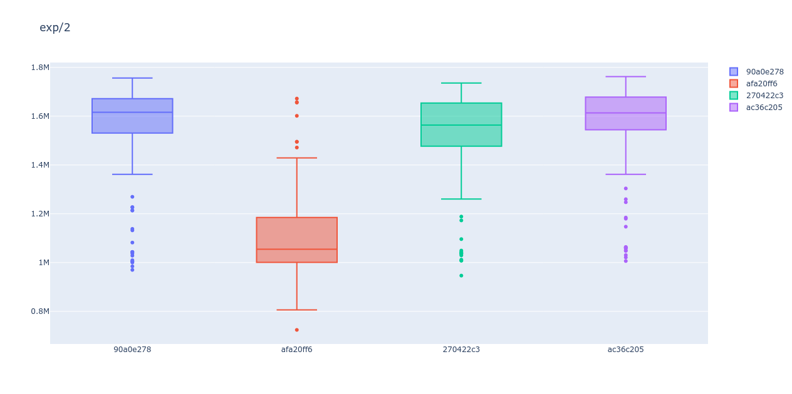

# Benchmark Zenohd of Different Commits

## How to use?

1. Choose which commits you want in the file __./selected-commits.txt__.

    The default selected commits are

    ```txt
    afa20ff6
    270422c3
    ac36c205
    90a0e278
    ```

2. Setup the environment. This step includes

    * Download and build zenoh-pico
    * Download zenoh, create worktrees for each commits, and compile them.
    * Install required python libraries for plotting.


    ```bash
    make setup_all
    ```

3. Run the benchmark and plot the results.

    ```bash
    make run_all
    ```

## Example



## How to adjust?

The default payload size is 8. You may adjust this value in __./benchmark.sh__.


```bash
...
# Some parameters to adjust
n_exp=2          # total number of experiments
duration="10s"   # testing time of each experiments
payload_size=8   # payload size used in pub
...
```

